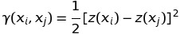
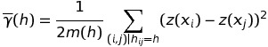
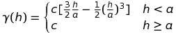

###Method

One fundamental concept of Kriging is spatial auto-correlation: an attribute value can be correlated to itself, with the strength of the correlation depending on separation distance (and possibly direction). The correlation is often expressed as **semi-variance**. Each pair of observation points has a semi-variance, and usually represented as the Greek letter Gamma, and defined as:

where x is a geographic point and z(x) is its attribute value.

The theory of stationary random fields is based on the assumption that absolute location is not important, but only relative location, and the tool for exploring this is the **empirical variogram**, which defined as the average semivariance within some separation range: 

where hij is the distance between points i and j; =h means that this point-pair has the separation vector; h is some small range, the bin.

This spatial dependence is then summarized with a variogram model. From many studies we know that a commom model is the **spherical model**:

where a is the range, separation at which there is no more spatial dependence; c means sill, the maximum semivariance. 

###Rent Data

Plot the experimental variogram of the log rent concentrations, i.e. the average semi-variances of the point-pairs versus average distance (lag), with a bin width of 100m, to a maximum lag distance of m.

###Sell Data